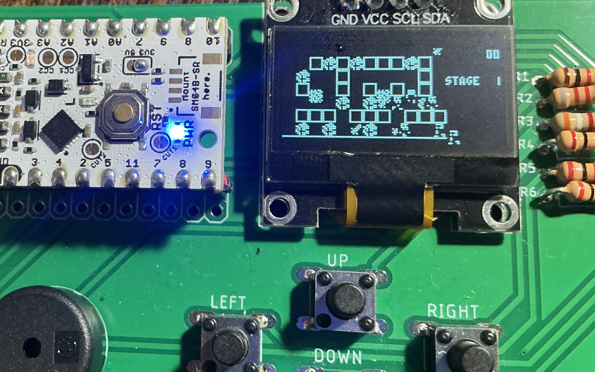

# UIAPduino+SSD1306版 SwordWork mini

宝箱を全て取るとクリアーです。  
アイテムを取ると攻撃距離が伸びます。

## 操作

|操作|割り当て|
|-|-|
|移動|UP, DOWN, LEFT, RIGHT|
|ジャンプ|ACT|

## 動作確認済みハードウエア

* [UIAPduino開発支援ボード](http://www.picosoft.co.jp/CH32V/)  
USB給電の場合はUIAPduinoの電圧選択ジャンパーを3.3Vにしてください。
